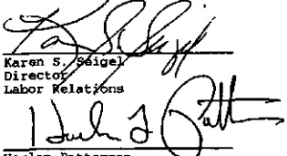
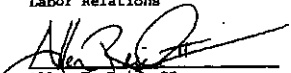

THIS AGREEMENT was executed on the 23rd day of May, 2005 by the parties hereto as evidenced by the following signatures:

FOR THE UNION:

Kévin G. Dodd

Sr. Business Representative E.A.S.T., Local #1553

Errol G. Jackson

Asst. Sr. Business Representative

E.A.S.T., Local #1553

Steve M. Grigga

Financial Secretary

E.A.S.T., Local #1553

Kenneth M. Keyster

Recording Secretary

E.A.S.T., Local #1553

FOR THE COMPANY:

Richard P. Johnston

Vice President

SAS Operations

W. Edward Anderson, Jr.

Vice President

SAS Human Resources

Harlan Patterson

Director

Operations

Dawn C. Garrett

Director

Operations

Raul Pichardo

Manager

Labor Relations

Allen F. Reid II

Human Resources Consultant

Operations