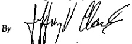

To create a proper environment for the committee's work, no aspect of the Committee's proceedings or any aspect of this Letter of Understanding shall be used as the basis for, or as evidence in, any proceedings under Article 3.

Dated October 25, 2004

Society of Professional Engineering

Employees in Aerospace

By Gengle, Markey

President

The Boeing Company

Senior Manager, Employee & Union Relations

Attachment 2

## LETTER OF UNDERSTANDING RELATING TO CHILD/ELDER CARE PROGRAM

The Company will continue a comprehensive child and elder care program. The program will consist of referrals of employees to licensed care facilities, consultation with employees to determine individual needs, and providing educational materials and programs.

Dated October 25, 2004

Society of Professional Engineering

Employees in Aerospace

By Geriaga

The Boeing Company

By

Senior Manager, Employee & Union Relations

Attachment 3

## LETTER OF UNDERSTANDING RELATING TO DRUG AND ALCOHOL FREE WORKPLACE PROGRAM

The Company and the Union enter this Letter of Understanding to address the serious societal problem of drug and alcohol abuse. The Company and the Union affirm their joint objective to achieve a drug and alcohol free workplace while complying with applicable government laws and regulations. To that end, the parties agree to a drug and alcohol free workplace program as described in PRO-388.

The Company will continue its drug and alcohol awareness program designed to keep employees informed of the drug and alcohol free workplace program, including opportunities for professional assistance through the EAP, the dangers of drug and alcohol abuse, and drug and alcohol testing.

The Company will maintain a drug and alcohol free workplace training program for its managers, medical professionals, and other selected employees. Union selected individuals, including but not limited to the Union's Executive Board, Council Representatives, and staff members, will be invited to participate in training. Once a year the Union will provide the Company with a list of those persons to be trained.

The Company will implement a drug and alcohol testing program designed to deter abuse and to provide a means for early identification, referral for treatment, and rehabilitation of employees with abuse problems. The Company will at all times comply with its policy and procedures and with applicable government laws and regulations designed to safeguard the accuracy and reliability of drug and alcohol testing and to protect the confidentiality of those tested.

For reasonable suspicion and post-accident testing only, the employee has the right to request the presence of a Union Representative at the collection site. The Union Representative shall not in any way interfere