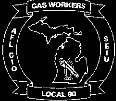

COLLECTIVE

BARGAINING

AGREEMENT

between

michcon

MICHIGAN CONSOLIDATED GAS COMPANY

Detroit District

and

GAS WORKERS LOCAL #80

SERVICE EMPLOYEES INTERNATIONAL UNION

A.FL - C.I.O.

Effective December 3, 2000