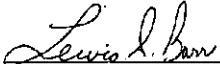
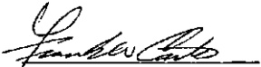
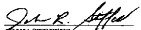

## ARTICLE XIX

Good Faith Signatures – The Company, for itself, and the Union, for itself and its members, each agree that they will in good faith abide by all the terms and conditions of this

Agreement.

SIGNED – On behalf of

Michigan Consolidated Gas Company

LEWIS S. BARR, Director

Safety and Labor Relations

On Behalf of Gas Workers Local #80

Service Employees International Union, AFL-CIO

FRANK W. CARTER

President

RICHARD HARKINS

Executive Vice President

ED WOODS

Secretary-Treasurer

JOHN STEFFES

Vice-President