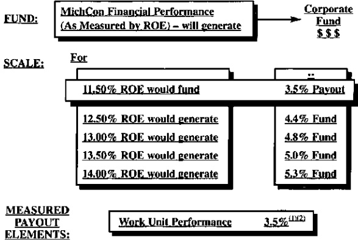

## Notes:

(1) After subtracting the amount to be added to the applicable classified wage rate for each year of the contract, the remaining portion of said fund will be available to pay out as a lump sum payment to eligible employees for success against department work unit performance monies in accordance with existing MichCon Administrative Guidelines for the Corporate Pay for Results Program for Union employees.

During the term of this Agreement, all lump sum payments payable under the MCN Pay Program shall be effective in March of each year following Board approval of the ROE for the prior year.

(2) Effective with the year the Merger is completed, the fund to be used for the Union Incentive Program will be determined by the amount of money DTE Energy sets aside for its Union Incentive Program that year and for each year of the remaining years under the contract.