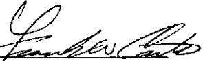

Mr. Frank W. Carter, President

Gas Workers Local #80, S.E.I.U., AFL-CIO

2604 Fourth Street

Detroit, MI 48201

## Gentlemen:

This will confirm the understanding reached between both parties that the following summaries of Letters of Agreement are hereby incorporated in their entirety, as part of this Collective Bargaining Agreement for the term of the contract.

Very truly yours,

LEWIS S. BARR, Director

Safety. Labor Relations & Absence

ACCEPTED ON BEHALF OF

GAS WORKERS LOCAL #80, S.E.I.U., AFL-CIO

FRANK W. CARTER

President

Date: December 3, 2000