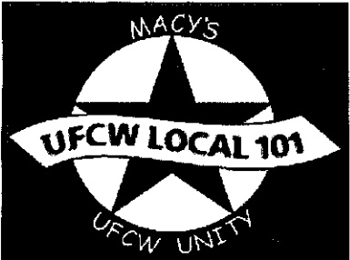
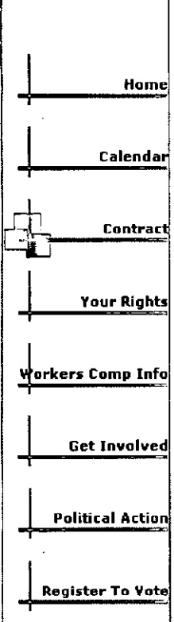

# Contract

Local 101 2005 Scholarship Pre-Application Deadline, January 31, 2005 - click here for information

COLLECTIVE BARGAINING AGREEMENT

between

MACY'S WEST, INC

and

UNITED FOOD AND COMMERCIAL WORKERS

LOCAL 101

June 1, 2004 through May 31, 2008

THIS AGREEMENT, made and entered into, by and between MACY'S WEST, Inc., hereinafter referred to as the Employer, and United Food and Commercial Workers Union, LOCAL 101, chartered by the United Food and Commercial Workers Union AFL-CIO & CLC, hereinafter referred to as the Union.

## SECTION 1 - RECOGNITION

The Union is recognized as the sole collective bargaining agent for all employees employed at the Macy's Downtown San Francisco Store, Stonestown Store and Divisional Offices except executives as defined in Section 2. (Definition of Executives) and for the classifications listed in Appendix A.

Any department covered by the terms of this agreement which moves from the Downtown San Francisco Store or Stonestown Store to another location, within the Local 101 jurisdiction in the City and County of San Francisco, shall be covered by the terms and conditions of this Collective Bargaining Agreement, provided, the employees remain on the payroll of the employer.

“Satellite” operations of a department of the Downtown San Francisco Store(s) or Stonestown Store shall