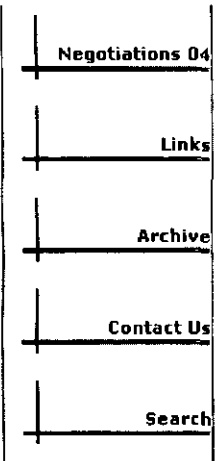

Site Visits 10652

be covered by the terms and conditions of this Collective Bargaining Agreement.

## SECTION 2 - DEFINITION OF EXECUTIVES

An executive is defined as an employee having the duty and responsibility of directing the operation of a store, or a selling or non-selling department, or sub-division thereof, and who customarily and regularly exercises discretionary power and except for executives employed in an administrative capacity, must customarily and regularly direct the work of other employees and have the authority to hire and fire other employees, or be an employee whose suggestions and recommendations as to hiring and firing, and as to advancement or promotion, or any other changes of status of the employee, will be given particular weight. See also Section 26.

It is understood that the Support Team Leader position in Stonestown is covered under Section 2. The total number of Selling Managers in Stonestown shall be limited to three (3) per season.

## SECTION 3 - UNION MEMBERSHIP

A. There shall be no discrimination by the Employer against any employee or applicant on account of membership in or activity on behalf of the Union.

B. Those employees who are members of the Union, or who become members, must continue their membership in good standing for the life of the present Agreement as a condition of employment. All employees hired on and after February 1, 1968, shall within thirty-one (31) days following their employment become members and maintain membership in the Union.

C. "Good standing," for the purpose of this Agreement, shall mean that the employee shall tender, in accordance with applicable law, the periodic dues and the initiation fees uniformly required as a condition of acquiring or retaining membership in the Union.

The Union will send to the company, by noon each Monday, a list of employees who they want terminated for non-payment of dues. Once this list is submitted, the names shall be non-revocable by the Union, and the Employer will terminate effective Tuesday. However, in the event that an employee complies after the notice to the Employer but prior to the termination, it is the employee's responsibility to provide this written verification from the Union to the Human Resources Representative prior to the termination. In such circumstances Employer will not terminate said employee. Employees terminated under this provision will have no right of re-instatement and such termination shall not be subject to the grievance procedure.

The Union agrees to indemnify and hold the Employer harmless in any and all claims and/or causes of