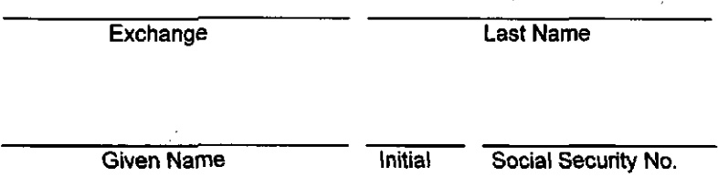

# EXHIBIT "C" EFFECTIVE 12:01 A.M., OCTOBER 27, 2002

DUES DEDUCTION AUTHORIZATION

To Verizon North Inc.:

I hereby authorize and request Verizon North Inc., hereinafter called the Company, to deduct from my pay, until such authorization is revoked in writing by me, commencing with the month following the receipt of this authorization by the Company, and remit to Local Union No. 986 of the International Brotherhood of Electrical Workers, A.F.L. - C.I.O., hereinafter called the Union, Union dues in the amount of $ ___ per month, or in such other amount as may be provided for in the Constitution and By-Laws of the Union; provided, however, that such other amount shall not be deducted until after receipt by the Company from the Union of a certified copy of the Amendment authorizing such other amount.

Said monthly deductions shall be made from my pay for the first payroll period in each month, unless the amount of pay due me for such payroll period is not sufficient to provide for said deduction, in which event said deduction shall be made from my pay in any subsequent payroll period in which there is due me an amount of pay sufficient to provide for said deduction.

The amounts deducted as authorized herein shall be remitted to the Treasurer of Local Union No. 986 I.B.E.W. of the A.F.L. – C.I.O., and no receipt for the amounts so deducted will be given me by the Company, although the deduction will be itemized on the stub of my payroll check.

In the event I revoke this authorization, the Company will discontinue the payroll deduction of my Union dues in the month following that in which my revocation is received by the Company.

Date

Signed