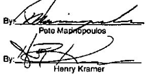
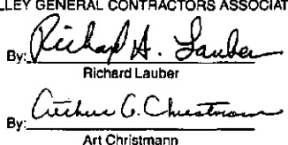

IN WITNESSWHEREOF, the parties have executed this Agreement to be effective as of June 1, 2000.

ILLINOIS DISTRICT COUNCIL NO. 1 OF THE INTERNATIONAL UNION OF BRICKLAYERS AND ALLIED CRAFTWORKERS

LOCAL 14, LOCAL 20, LOCAL 21, LOCAL 27, LOCAL 56, LOCAL 74

MASON CONTRACTORS ASSOCIATION OF GREATER CHICAGO

BUILDERS ASSOCIATION OF GREATER CHICAGO

FOX VALLEY MASON CONTRACTORS ASSOCIATION

LAKE COUNTY CONTRACTORS ASSOCIATION

SOUTH DUPAGE MASON CONTRACTORS ASSOCIATION

FOX VALLEY GENERAL CONTRACTORS ASSOCIATION

By: Richard Lauber

Rv. Ciechner G. Cheston

Art Christmann