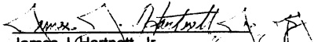

# Memorandum of Understanding Between the Commonwealth of Massachusetts and the Massachusetts Organization of State Engineers and Scientists

## MBTA Passes

Contingent on compliance with all federal and state regulations, and as soon as is administratively feasible for the Employer, the Commonwealth agrees to deduct the cost of MBTA passes from an employee's salary on a pre-tax basis for all employees who wish to participate in such a program.

The Provisions of this Memorandum of Understanding shall be coterminous with the duration of this collective bargaining agreement as provided in Article 29.

Signed this 16 $ ^{th} $ day of November, 1999.

For the Massachusetts Organization of State Engineers and Scientists:

Merry Christmas

Mary Richards, President

For the Commonwealth of Massachusetts:

James J. Hartnett, Jr. Personnel Administrator

