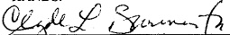
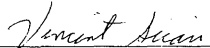

treatment is necessary periodic reports on the employee's progress and/or compliance will be made to the County. Failure by the employee to comply with the rehabilitation program could result in disciplinary action.

Positive test results for an employee shall be defined as refusal to take a drug or alcohol test, refusal to give a sample, or positive test results as determined by testing and confirmation. The following lists the consequential actions concomitant with positive results:

## POSITIVE TEST

ALCOHOL (concentration of .08 or greater)

a. First Instance: Voluntary EAP

b. Second Instance: Written reprimand and mandatory EAP

c. Third Instance: Thirty (30) days suspension and mandatory EAP

d. Fourth Instance: Termination (within two (2) years of the third instance)

DRUGS: MARIJUANA, COCAINE, AMPHETAMINES, OPIATES (including HEROIN), PHENCYCLIDINE (PCP):

a. First Instance: Mandatory EAP

b. Second Instance: Thirty (30) days suspension and mandatory EAP

c. Third Instance: Termination (within two (2) years of the second instance)

Accruals – An employee who is absent from work as a result of a positive test or as a result of his or her undergoing treatment in an EAP sponsored rehabilitation program will be allowed to use any leave time pursuant to the collective bargaining agreement, in accordance with the regulations and restrictions contained within the current bargaining agreement.

Nothing in this policy is to be construed as a denial of rights guaranteed by the Collective Bargaining Agreement except those of this policy which supersede State or Federal Law. Any discipline that may result from a violation of the alcohol and drug policies shall be subject to the Discharge and Discipline provisions of the collective bargaining agreement.

The Union President shall be immediately provided a complete listing of all bargaining unit members who are tested. The Union may thereafter review any negative reasonable suspicion testing. Such review shall be through the contract's grievance and arbitration mechanism. Each such question should be initiated by the Union directly at Stage 3. Should an arbitrator ultimately determine that there was bad faith on the part of the Department Head who initiated the reasonable suspicion test, or that he/she otherwise

acted in an arbitrary or capricious manner, the arbitrator may award the employee involved up to one-day's pay at his/her regular straight time rate, and any other penalty deemed appropriate by the arbitrator.

## IN SUMMARY

Niagara County agrees that it shall not unilaterally act to change the terms or procedures encompassed within this policy.

THE TESTING POLICY WILL NOT GO INTO EFFECT UNTIL THE COUNTY HAS AN EMPLOYEE ASSISTANCE PROGRAM IN PLACE.

IN WITNESS WHEREOF, THE PARTIES TO THIS AGREEMENT SET THEIR HANDS.

CLYDE BURMASTER, CHAIRMAN

COUNTY LEGISLATURE

Date: 3/20/2022

Robert de la Matière

ROBERT L. SCHUMAN

MANAGER - LABOR RELATIONS

Date: 3/17/2000

## APPROVED:

NIAGARA COUNTY ATTORNEY

By

Date:

LINDA GIBBONS, PRES. NIAGARA

COUNTY UNIT OF CSEA

CANDY SAXON

LOCAL #832

Date: 3/7/2016

LABOR RELATIONS SPECIALIST

Date: 3/14/2000

VINCENT SICARI

LABOR RELATIONS SPECIALIST

Date: 3/14/2000