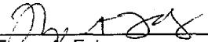
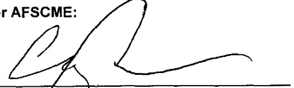

# APPENDIX E SIDE LETTER AGREEMENT HOURS OF WORK – OVERTIME COMPENSATION FOR ALTERNATIVE SCHEDULES

## UNIVERSITY OF CALIFORNIA

BERKELEY · DAVIS · IRVINE · LOS ANGELES · MERCED - RIVERSIDE · SAN DIEGO · SAN FRANCISCO

OFFICE OF THE SENIOR VICE PRESIDENT — BUSINESS AND FINANCE

OFFICE OF THE PRESIDENT

300 Lakeside Drive

Oakland, California 94612-3550

AFSCME – EX Unit Mediation

May 25, 2004

5:09 AM

Side Letter re: Hours of Work – Overtime Compensation for Alternative Schedules

UC San Francisco shall pay Patient Care Technical (EX) unit employees time and one-half (1½ X) pay after a regularly scheduled shift. Application of this provision is subject to negotiation.

UCSF shall pay Weekend Differential to EX unit employees whose shift includes weekend work. The definition of weekend work for purposes of this provision is subject to negotiation.

Upon the union’s written request, as soon as possible after the ratification of the collective bargaining agreement, UC San Francisco and AFSCME will negotiate the above provisions.

Agreed:

For the University of California:

Fréya A. Foley

Chief Negotiator, University of California

David Odata

Director, Human Resources

Date

University of California, San Francisco Medical Center

For AFSCME:

Craig Merrilees

Chief Negotiator, AFSCME

 $ \frac{5-26.04}{Date} $

Date