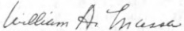
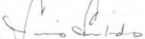
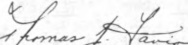
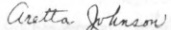
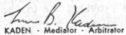

52-3. The Board recognizes that the statements contained in Board's Policies, Administrative Rules and Regulations, School Board Bylaws are not to stand in conflict with existing collective-bargaining agreements and, in the event that any statement of the Board's Policies, Administrative Rules and Regulations, School Board Bylaws should conflict with such collective-bargaining agreements, then such statement shall be modified to the extent necessary to conform to such collective-bargaining agreements.

IN WITNESS WHEREOF, the parties hereto have caused these presents to be signed by their duly authorized officers this 30th day of November, 1978.

## BOARD OF EDUCATION OF THE CITY OF JERSEY CITY

Margaret B. O'Hara

MARGARET B. Di NARDO - Assistant Superintendent of Schools

WILLIAM A. MASSA - Attorney for The Board of Education

LOUIS SERTERIDES - Assistant Attorney for The Board of Education

JERSEY CITY EDUCATION ASSOCIATION

LOUIS T. SCIALLI - President, Jersey City Education Association

THOMAS J. FAVIA - 1st Vice-President, Jersey City Education Association

ARETTA JOHNSON - 2nd Vice-President, Jersey City Education Association

LEWIS B. KADEN - Mediator - Arbitrator