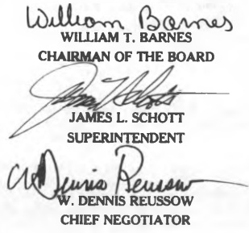
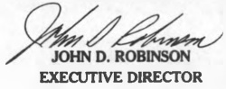

## ARTICLE XXVI DURATION

A. The provisions of this Contract shall be effective from the date of ratification by both parties and shall continue and remain in full force and effect except as modified in accordance with the provisions of this Contract through and including June 30, 1990.

B. Salary, supplemental pay and fringe benefits shall be retroactive to July 1, of each fiscal year.

SCHOOL BOARD OF

ORANGE COUNTY, FLORIDA

William Barnes

WILLIAM T. BARNES

CHAIRMAN OF THE BOARD

JAMES L. SCHOTT

SUPERINTENDENT

Aurisa Reussow

W. DENNIS REUSSOW

CHIEF NEGOTIATOR

ORANGE COUNTY

CLASSROOM TEACHERS ASSOCIATION, INC.

Ernest Kennell

ERNEST FENNELL

PRESIDENT

JOHN D. ROBINSON

EXECUTIVE DIRECTOR