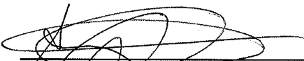
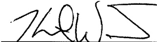
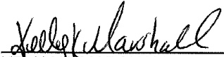
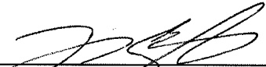
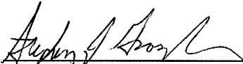

This agreement will remain in full force and be effective for three (3) years from the date of approval by DCPAS, or, under the provisions of 5 USC Section 7114, (c) (3) whichever comes first. It is understood that this agreement will terminate at any time that the Union is no longer entitled to exclusive representation under Title 5 USC Chapter 71.

As stated in the Preamble, this is a living agreement which may be reviewed and/or modified upon the consent of both Parties.

GREGORY J. MADNATS

MG, MIARNG

The Adjutant General

JAMES K. SWEAT

LIUNA Local 2132

State Representative for Local 2132

KEVIN L. WEISE, MAJ

Deputy General Counsel

BEN BANCHS

KELLY K.MARSHALL, MAJ

LIUNA Local 1776

Labor Relations Specialist

Business Manager

CHRISTOPHER L. SHAPARDON, SSG

Negotiator

JESSICA S. ULREY, CW3

Negotiator

JOSEPH A. COGNITORE, LTC

JEFFREY A. BUSSARD, SSG

Negotiator

STEPHEN J. GRASZLER, SFC

ANTHONY T. KRUCKEBERG, CW3

Negotiator

Alternate Negotiator

